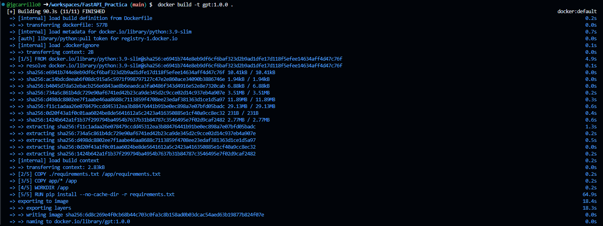
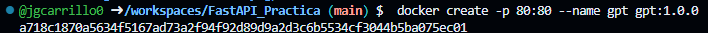
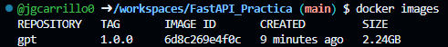
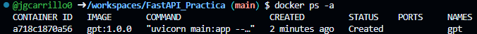
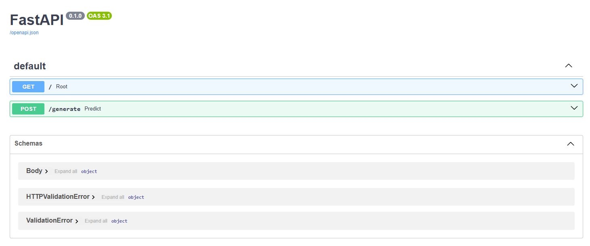
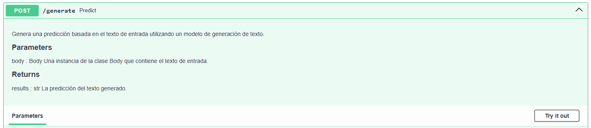
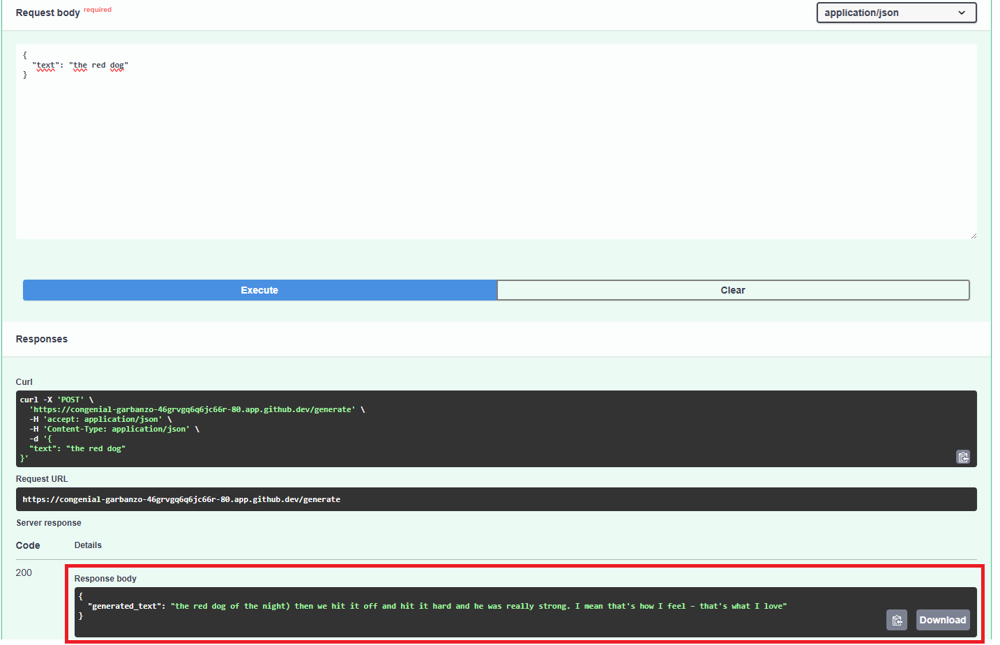

# FastAPI, Práctica de despliegue de una API

## 📌 Objetivo de la Práctica

Hacer uso de la herramienta de Codespaces de GitHub para realizar el despliegue de una aplicación mediante un contenedor de Docker.
* Hacer uso del marco web FastAPI para desplegar un servicio
* Desplegar de forma sencilla un servicio que use el modelo GPT-2 para generar texto a partir de una entrada (texto inicial)
* Hacer uso del Uvicorn para implementar un servidor web ASGI
* Usar Docker para desplegar la herramineta

## 📚 Conceptos básicos

### 💡 ¿Qué es una API?

Una API, o Interfaz de Programación de Aplicaciones (Application Programming Interface, en inglés), es un conjunto de reglas, protocolos y herramientas que permiten a diferentes aplicaciones de software comunicarse entre sí. En esencia, una API especifica cómo interactuar con un software o servicio, proporcionando una serie de métodos, funciones y datos que otros programas pueden utilizar para realizar ciertas acciones o acceder a recursos específicos.


### 💡 ¿Qué es FastAPI?

FastAPI es un marco de desarrollo web de Python de alto rendimiento y fácil de usar para crear APIs web rápidas. Está construido sobre las capacidades de Starlette y Pydantic, lo que lo hace rápido, fácil de escribir y mantener, y altamente eficiente en el uso de recursos. FastAPI utiliza la tipificación de Python para proporcionar una documentación automática y precisa, así como una validación de datos, lo que hace que el desarrollo de APIs sea más rápido y seguro. Además, soporta la generación automática de documentación interactiva basada en el estándar OpenAPI y Swagger UI.

### 💡 ¿Qué es Uvicorn?

Uvicorn es un servidor ASGI (Asynchronous Server Gateway Interface) de alto rendimiento para aplicaciones web Python. Es ampliamente utilizado en el ecosistema de desarrollo web de Python, especialmente con marcos como FastAPI, Starlette y otros que admiten ASGI.

Uvicorn se destaca por su capacidad para manejar conexiones de red de forma asíncrona, lo que significa que puede manejar muchas solicitudes simultáneamente sin bloquear el hilo principal de ejecución. Esto lo hace ideal para aplicaciones web modernas que necesitan manejar un alto volumen de tráfico de manera eficiente.

Además de su rendimiento, Uvicorn es conocido por su facilidad de uso y su integración perfecta con otros componentes del ecosistema de Python, como asyncio y el ecosistema de herramientas de desarrollo web como FastAPI, lo que lo convierte en una opción popular para implementar aplicaciones web modernas y escalables.

### 💡 ¿Qué es Docker?

Docker es una plataforma de software que permite crear, desplegar y ejecutar aplicaciones de manera fácilmente reproducible en entornos virtuales llamados contenedores. Los contenedores son entornos ligeros y portables que contienen todo lo necesario para que una aplicación se ejecute de manera independiente, incluyendo el código, las bibliotecas y las dependencias. Docker simplifica el proceso de desarrollo, prueba y despliegue de aplicaciones al proporcionar un entorno consistente que asegura que la aplicación se ejecute de la misma manera en cualquier lugar donde se ejecute Docker.

## 📦 Descripción de los ficheros

Se recomienda ingresar a cada uno de los archivos y leer la documentacón incluida.

* **app/main.py**: Directorio que contiene el archivo de python con el código de la app
* **Dockerfile**: Archivo de Docker con las instrucciones para construir la imagen de Docker a usar
* **requirements.txt**: Archivo de requerimientos con las librerías que usará la app

## 📑 Pasos a seguir
1. Ingresar a codespaces
2. Crear un nuevo codespaces, selecionando el repositorio de la práctica
3. En la terminal desplegada realizaremos lo siguiente:
   
   a. Construir la imagen de Docker a partir de las instrucciones del Dockerfile. Le daremos el nombre gpt y la etiqueta 1.0.0
   
   ```bash
    docker build -t gpt:1.0.0 .
   ```
   
   <p align="center">
    
   </p>
   b. Crearemos el contenedor que contendrá la imagen previamente creada. Mapearemos los puertos 80 de la maquina anfitrión y del contenedor, le daremos el nombre de gpt al contenedor y usaremos la imagen gpt:1.0.0
   
   ```bash
     docker create -p 80:80 --name gpt gpt:1.0.0
   ```
   
   <p align="left">
    
   </p>
   c. Podemos verificar si la imagen fue creada:
   
   ```bash
     docker images
   ```
   
   <p align="left">
    
   </p>
   d. Podemos validar si el contenedor fue creado:
   
   ```bash
     docker ps -a
   ```
   
   <p align="left">
    
   </p>
   e. Activaremos el contenedor:
   
   ```bash
     docker start gpt
   ```
   
   <p align="left">
    
   </p>
5. Se dará la opción de abrir el navegador, y nos mostrará la página con nuestra api lista:
   <p align="center">
    
   </p>
6. Desplegaremos la sección de **POST** y daremos click en **Try it out**, con lo cual podremos usar el modelo:
   <p align="left">
    
   </p>
7. Daremos un texto inicial, luego daremos click en **Execute**, y obtendremos la respuesta:
   <p align="left">
    
   </p>
8. Para detener el contenedor usamos

   ```bash
     docker stop gpt
   ```

## ⚠️ Consideraciones

* Si lo esta realizando en un entorno local asegurese de tener instalado Docker
* La aplicación funcionará mientras el contenedor siga activo
* Si al momento de lanzar la app genera error, actualice la página  
